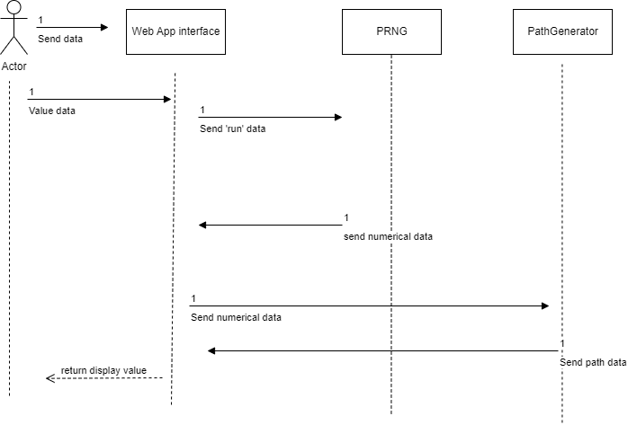

# Communication Contract for Microservice

## Requesting Data

Data is requested via text file through a run command, that will trigger other files to read and write. This means that in the UI there is a button/link that will clicked. This would then iniate the microservice, by writing out a keyword that will be used in the read and write of other seperate files. 

## Receive Data

Data is received through a text file that contains either a path or a specfic value that will used for the rendereing. The UI will read the contents of the text file that will then be used to render specific items on a page. 

## Example Call
- A button on the UI sends a text 'run' to a text file. 
- A prng service file reads the 'run' calls a generate random function and writes to it
- The UI file then reads that numerical value and writes it to another text file (image/path)
- An image/path file will then read the numerical value and put a path/text to the file 
- UI will render the information written to the image/path file. 

## UML Diagram

